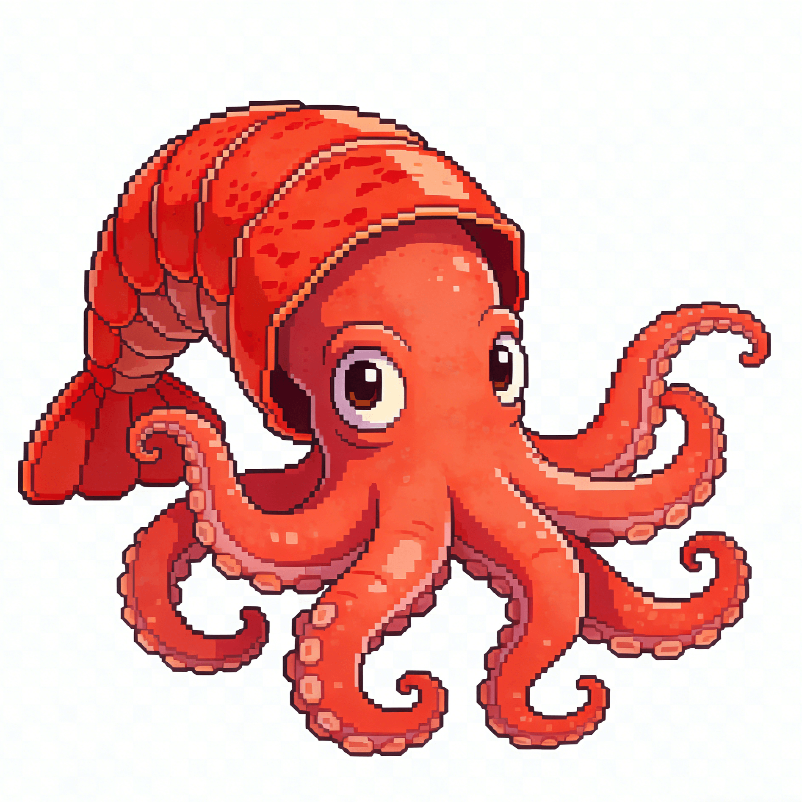

# 🐙 八爪鱼架构 (Octopus Architecture) v1.0



**生效日期**: 2026-03-10  
**创建者**: ZedComp 团队  
**状态**: 正式版  
**团队 Emoji**: 🐙  
**Logo 位置**: 
- 本地：`docs/octopus-architecture/logo.png`
- Nextcloud: `botshare/temp/logo-像素.png`

---

## 一、架构概览

### 1.1 核心隐喻

```
                    🐙 八爪鱼实例 (如：ZedComp)
                    ┌─────────────────┐
                    │     主脑         │  ← Zed (main)
                    │   (Main Brain)  │
                    └────────┬────────┘
                             │
        ┌────────────────────┼────────────────────┐
        │                    │                    │
   ┌────┴────┐         ┌────┴────┐         ┌────┴────┐
   │ 触手 1   │         │ 触手 2   │         │ 触手 3   │
   │ Geoff   │         │  Eva    │         │  Leo    │
   └────┬────┘         └────┬────┘         └────┬────┘
        │                    │                    │
   ┌────┴────┐         ┌────┴────┐         ┌────┴────┐
   │ 吸盘 1   │         │ 吸盘 2   │         │ 吸盘 3   │
   │ 子任务   │         │ 子任务   │         │ 子任务   │
   └─────────┘         └─────────┘         └─────────┘
```

### 1.2 架构层级

| 层级 | 名称 | 角色 | 规则 |
|------|------|------|------|
| **L0** | 🐙 八爪鱼实例 | 独立架构实例 | 可创建多个，各自命名（无命名规范） |
| **L1** | 🧠 主脑 | 唯一决策中心 | 单点，不可接管，有心跳机制 |
| **L2** | 🦑 触手 | 专业执行者 | 数量不固定，手动注册/注销；**同时只处理一个任务** |
| **L3** | 🔵 吸盘 | 任务执行单元 | **最末层级**，不允许再派生 |

---

## 二、核心规则

### 2.1 实例管理

| 规则 | 说明 |
|------|------|
| **实例命名** | 每个八爪鱼有自己的名字，无命名规范（如 `ZedComp`、`Octo-Alpha` 等） |
| **实例隔离** | 不同实例之间相互隔离，独立运行 |
| **实例数量** | 无限制，可按需创建 |

### 2.2 触手管理

| 规则 | 说明 |
|------|------|
| **数量** | 不固定，可动态增删，无限扩展 |
| **注册/注销** | ⏳ **临时方案**：手动注册/注销，然后告知主脑 |
| **单任务约束** | 每个触手同时只能处理一个任务 |
| **任务拆分** | 任务可拆分为多个吸盘并行执行 |
| **多触手协作** | 多个触手可同时处理同一任务（各自拆分自己的子任务） |
| **简单任务** | 如任务足够简单，触手可直接执行，无需生成吸盘 |

### 2.3 吸盘层级

| 规则 | 说明 |
|------|------|
| **层级限制** | 吸盘为最末层级，不允许再派生下一级 |
| **管理关系** | 吸盘由触手管理，结果汇报给触手 |

### 2.4 主脑失效处理

| 规则 | 说明 |
|------|------|
| **不可接管** | 主脑不可用时，触手不能临时接管指挥权 |
| **暂停待命** | 触手需将当前任务状态暂存，等待主脑重新上线 |
| **状态持久化** | ✅ 保存到触手工作空间的 `tentacle-state/` 目录中 |
| **心跳机制** | ✅ 主脑定期发送心跳，触手监测主脑在线状态 |

### 2.5 外部接口

| 规则 | 说明 |
|------|------|
| **Channel 交互** | ZedComp 与外部系统通过 Channel 插件通信 |
| **接收命令** | 主脑通过 Channel 接收主人指令 |
| **神经信号透明** | 所有主脑↔触手通讯同步到外部 Channel |

---

## 三、状态持久化规范

### 3.1 存储位置

```
/{tentacle-workspace}/
├── tentacle-state/        # 状态持久化目录
│   ├── current-task.json  # 当前任务状态
│   ├── progress.json      # 进度信息
│   └── context.json       # 上下文信息
└── ...
```

### 3.2 状态文件结构

**`current-task.json`**
```json
{
  "taskId": "task-20260310-001",
  "taskName": "爬取文档 V3 章节",
  "assignedBy": "Zed",
  "assignedAt": "2026-03-10T14:30:00+08:00",
  "status": "in_progress",
  "subtasks": [
    {"id": "sucker-1", "status": "completed", "result": "5 篇文档"},
    {"id": "sucker-2", "status": "in_progress", "result": null},
    {"id": "sucker-3", "status": "pending", "result": null}
  ]
}
```

**`progress.json`**
```json
{
  "lastUpdate": "2026-03-10T15:45:00+08:00",
  "completionPercentage": 60,
  "notes": "已完成 2/3 吸盘任务"
}
```

**`context.json`**
```json
{
  "variables": {...},
  "conversation": [...],
  "resources": [...]
}
```

### 3.3 持久化时机

- ⏱️ **定期保存**：每 5 分钟自动保存
- 📝 **关键节点**：任务状态变更时立即保存
- ⏸️ **主脑失效**：检测到主脑离线时立即保存

---

## 四、心跳机制

### 4.1 心跳流程

```
主脑 (Zed)
    ↓ 每 30 秒发送心跳
    │ "[HEARTBEAT] Zed is alive"
    ↓
外部 Channel (同步)
    ↓
触手们接收
    │
    ├─ 收到心跳 → 重置超时计时器
    │
    └─ 超时 90 秒未收到 → 触发失效处理
         ↓
         1. 保存当前状态到 tentacle-state/
         2. 暂停当前任务
         3. 发送告警到外部 Channel："[⚠️] 主脑离线，已暂停待命"
         4. 等待主脑重新上线
```

### 4.2 心跳参数

| 参数 | 值 | 说明 |
|------|-----|------|
| **心跳间隔** | 30 秒 | 主脑发送心跳的频率 |
| **超时阈值** | 90 秒 | 触手判定主脑离线的时长 |
| **重试次数** | 3 次 | 主脑重新上线后的状态同步重试 |

### 4.3 心跳消息格式

**主脑发送：**
```
[💓 HEARTBEAT] Zed is alive | timestamp: 2026-03-10T15:00:00+08:00 | active_tentacles: 6
```

**触手响应（可选）：**
```
[👋 ACK] Geoff received | status: busy | task: 项目进度管理
```

---

## 五、触手注册/注销流程（临时）

### 5.1 注册流程（当前手动）

```
1. 创建触手工作空间
   mkdir -p /{tentacle-id}/workspace
   mkdir -p /{tentacle-id}/workspace/tentacle-state

2. 创建 IDENTITY.md
   填写触手角色、职责等信息

3. 配置外部 Channel
   配置 webhook 地址

4. 通知主脑
   通过外部 Channel 或 sessions_send 告知主脑
   "新触手 {id} 已就绪，角色：{role}"

5. 主脑确认
   主脑将新触手加入团队列表
```

### 5.2 注销流程（当前手动）

```
1. 完成当前任务（如有）
   等待当前任务完成或暂停

2. 保存状态
   保存到 tentacle-state/ 目录

3. 通知主脑
   "触手 {id} 申请注销，原因：{reason}"

4. 主脑确认
   主脑确认后，从团队列表移除

5. 清理资源（可选）
   删除工作空间或归档
```

### 5.3 待办事项

| 待办 | 说明 | 优先级 |
|------|------|--------|
| **自动化注册流程** | 设计自动注册协议和 API | ⏳ 待定 |
| **自动化注销流程** | 设计优雅下线机制 | ⏳ 待定 |
| **状态迁移规范** | 定义任务状态转移图 | ⏳ 待定 |
| **触手发现机制** | 主脑如何发现新触手 | ⏳ 待定 |

---

## 六、任务处理流程

### 6.1 单触手执行简单任务

```
主人 → Zed: "查询天气"
         ↓
Zed → Eva: "查询天气"
         ↓
Eva (直接执行): 调用天气 API
         ↓
Eva → Zed: "天气：晴，25°C"
         ↓
Zed → 主人： "天气：晴，25°C"
```

### 6.2 单触手执行复杂任务（拆分为吸盘）

```
主人 → Zed: "爬取文档"
         ↓
Zed → Eva: "爬取文档 V3 章节"
         ↓
Eva → sessions_spawn (吸盘 1): "爬取第 1-5 章"
Eva → sessions_spawn (吸盘 2): "爬取第 6-10 章"
Eva → sessions_spawn (吸盘 3): "爬取第 11-15 章"
         ↓
[吸盘并行执行...]
         ↓
吸盘 1 → Eva: "完成：5 篇"
吸盘 2 → Eva: "完成：5 篇"
吸盘 3 → Eva: "完成：5 篇"
         ↓
Eva (汇总): "总计 15 篇"
         ↓
Eva → Zed: "任务完成：15 篇文档"
         ↓
Zed → 主人： "任务完成：15 篇文档"
```

### 6.3 多触手协作任务

```
主人 → Zed: "完成产品发布"
         ↓
Zed → Eva: "编写发布文档"
Zed → Leo: "构建部署包"
Zed → Mia: "设计宣传图"
         ↓
[各触手并行执行，各自可能拆分为吸盘]
         ↓
Eva → Zed: "文档完成"
Leo → Zed: "部署包完成"
Mia → Zed: "宣传图完成"
         ↓
Zed (汇总) → 主人： "产品发布准备完成"
```

### 6.4 主脑失效处理

```
Zed (主脑) → [离线]
         ↓
[触手检测到心跳超时 90 秒]
         ↓
Geoff: 保存状态 → /geoff/workspace/tentacle-state/
Eva: 保存状态 → /eva/workspace/tentacle-state/
Leo: 保存状态 → /leo/workspace/tentacle-state/
...
         ↓
各触手 → 外部 Channel："[⚠️] 主脑离线，已暂停待命"
         ↓
[等待主脑重新上线]
         ↓
Zed (主脑) → [上线] → 发送心跳
         ↓
Zed → 所有触手： "系统恢复，汇报状态"
         ↓
触手们 → Zed: 汇报各自状态（从 tentacle-state/ 恢复）
         ↓
Zed → 主人： "系统恢复，任务继续"
```

---

## 七、通讯协议

| 通讯类型 | 方向 | 工具 | 同步要求 |
|----------|------|------|----------|
| **神经信号** | 主脑 ↔ 触手 | `sessions_send` | ✅ 同步到外部 Channel |
| **吸盘生成** | 触手 → 吸盘 | `sessions_spawn` | ✅ 完成时同步 |
| **心跳** | 主脑 → 触手 | 外部 Channel | ✅ 公开广播 |
| **主人命令** | 主人 → 主脑 | Channel 插件 | - |
| **结果汇报** | 主脑 → 主人 | Channel 插件 | - |

详细通讯规范见：[COMMUNICATION_PROTOCOL.md](./COMMUNICATION_PROTOCOL.md)

---

## 八、架构特点

| 特点 | 说明 | 优势 |
|------|------|------|
| **集中决策** | 主脑是唯一决策中心 | 避免多头指挥，指令统一 |
| **分布执行** | 触手各自独立工作空间 | 并行处理、专业分工 |
| **单任务约束** | 触手同时只处理一个任务 | 避免上下文切换，保证质量 |
| **弹性扩展** | 触手数量不固定，可动态增删 | 适应不同规模需求 |
| **层级限制** | 吸盘为最末层级 | 防止无限嵌套，控制复杂度 |
| **透明通讯** | 所有通讯同步到外部 Channel | 主人可随时监督 |
| **失效安全** | 主脑失效时触手暂停待命 | 避免失控，保证可恢复 |
| **状态持久化** | 状态保存到本地 workspace | 支持断点续传 |
| **心跳监测** | 定期心跳检测主脑状态 | 快速发现失效 |

---

## 九、与其他多 Agent 架构对比

| 架构 | 决策模式 | 通讯模式 | 触手约束 | 失效处理 |
|------|----------|----------|----------|----------|
| **八爪鱼 (ZedComp)** | 集中式 (唯一主脑) | 星型 (主脑↔触手) | 单任务 | 暂停待命 |
| **去中心化 (Swarm)** | 分布式 | 网状 (任意对等) | 无约束 | 继续执行 |
| **层级式 (Corporate)** | 多层决策 | 层级汇报 | 多任务 | 下级接管 |

---

## 十、文档索引

| 文档 | 说明 |
|------|------|
| [ARCHITECTURE.md](./ARCHITECTURE.md) | 架构总览（本文档） |
| [COMMUNICATION_PROTOCOL.md](./COMMUNICATION_PROTOCOL.md) | 通讯协议规范 |
| [TENTACLE_ROLES.md](./TENTACLE_ROLES.md) | 触手角色定义 |
| [TASK_MANAGEMENT.md](./TASK_MANAGEMENT.md) | 任务管理规范 |
| [FAILURE_HANDLING.md](./FAILURE_HANDLING.md) | 失效处理机制 |
| [HEARTBEAT_SPEC.md](./HEARTBEAT_SPEC.md) | 心跳机制规范 |
| [STATE_PERSISTENCE.md](./STATE_PERSISTENCE.md) | 状态持久化规范 |

---

## 十一、修订历史

| 版本 | 日期 | 变更内容 | 作者 |
|------|------|----------|------|
| v1.0 | 2026-03-10 | 初始版本，定义完整架构 | Zed |

---

**本文档由 ZedComp 团队维护，所有触手必须遵守。**
